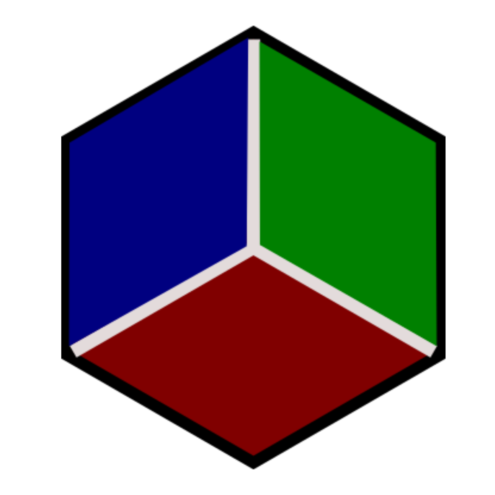

# GNG2101 - Z5 Group - Mill Right

A mill simulator created in Unity to emulate 'Beginner Mill Training' workshops offered by the MTC.

Simulator Walkthrough Playlist: https://www.youtube.com/playlist?list=PLbtWtcDoM0aI8Jd2YPEbDn1pBLO2CJmbG
